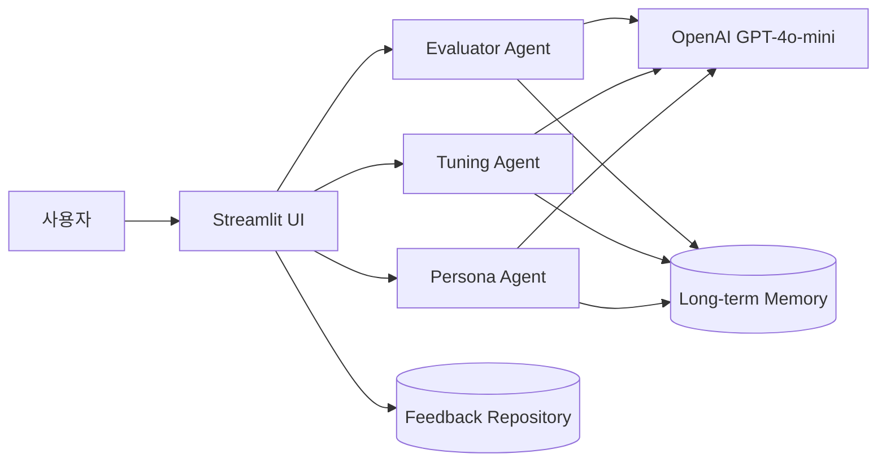

# 🚀 Prompt Camp to Academy

> **AI 네이티브 프롬프트 훈련 플랫폼**
> 두루뭉술한 질문은 그만! 스타 멘토와 함께 퀘스트를 깨며 완성하는 실전 AI 문해력 과정


---

## ✨ 프로젝트를 한 문장으로

**Prompt Camp to Academy**는 AI를 단순히 질문하는 도구가 아니라, **프롬프트를 반복해서 개선하고 자신의 AI 사용법을 기록하는 학습 공간**입니다.

왕초보는 부담 없는 퀘스트부터 시작하고, 중급 사용자는 실전 미션과 1:1 프롬프트 튜닝을 통해 단계적으로 성장합니다.

---

## 🎯 핵심 목표

### AI 문해력 향상
질문자의 의도, 역할, 맥락, 출력 형식까지 명확히 전달하는 프롬프트를 학습합니다.

### 실전 경험
할루시네이션, 문서 요약, 데이터 가공, 복잡한 지시 등이 포함된 실제 업무형 미션을 수행합니다.

### 개인화된 학습
유형별 스타 멘토를 선택하고, 사용자의 취약점과 학습 이력을 기억합니다.

### 재미 있는 성장
객관식 퀘스트, 배지, 점수, 진행도까지 게임처럼 진행합니다.

---

## 🧭 두 단계의 성장

```text
┌──────────────────────────────────────────────────────────────┐
│  1단계: Prompt Camp                                      │
│  └─ 기초 프롬프트 3개 마스터                              │
│       ↓                                                   │
│  🏆 사관학교 입교 합격증 발급                             │
│       ↓                                                   │
│  2단계: Prompt Academy                                    │
│  └─ 할루시네이션 사냥 및 실전 프롬프트 미션            │
│       ↓                                                   │
│  🔬 1:1 프롬프트 연구소                                  │
│       ↓                                                   │
│  💬 피드백 및 개인화된 학습 이력                         │
└──────────────────────────────────────────────────────────────┘
```

### 1단계 — Prompt Camp
- 타이핑 부담 없는 객관식 및 빈칸 퀴즈
- 역할, 목적, 출력 형식 등 핵심 3요소 학습
- 3개 퀘스트 완료 시 사관학교 입교 배지 발급

### 2단계 — Prompt Academy
- AI가 거짓말을 할 때 사실 확인하기
- 복합 지시와 문서 데이터 가공 수행
- 멘토가 개선한 프롬프트와 자신의 질문 비교

---

## 👥 스타 멘토 시스템

사용자는 자신의 학습 성향에 맞는 멘토를 선택할 수 있습니다.

| 멘토 | 성격 | 학습 방식 |
|---|---|---|
| **차도혁** | 날카로운 천재 선배 | 핵심을 찌르는 팩트 기반 코칭 |
| **유하린** | 따뜻하고 자존심 지킴이 | 긍정적 격려와 단계별 지원 |
| **강태산** | 열정적인 교관 | 체계적 미션과 높은 에너지 안내 |

### 멘토 이미지


---

## 🧠 AI 에이전트 구조



### Evaluator Agent
사용자의 프롬프트에서 역할, 맥락, 출력 형식, 목적의 충족 여부를 분석합니다.

### Tuning Agent
거친 질문을 구조화된 전문가 수준 프롬프트로 재작성하고, 수정 전후 결과를 함께 제공합니다.

### Persona Agent
선택한 멘토의 성격과 말투를 반영해 개인화된 코칭을 생성합니다.

### Long-term Memory
- 반복되는 프롬프트 취약점 저장
- 누적 점수 및 배지 관리
- 다음 학습에 반영되는 개인화 이력 유지

---

## 🖥️ 서비스 화면

### Prompt Camp
객관식 선택과 빈칸 퀴즈를 통해 프롬프트의 핵심 요소를 배웁니다.

### Prompt Academy
실제 문제가 발생했을 때 AI의 거짓말과 잘못된 답변을 판별합니다.

### 1:1 프롬프트 연구소
사용자의 질문과 멘토가 개선한 질문을 좌우로 비교해 품질 차이를 직접 체감합니다.

### 학습 대시보드
- 전체 진도율
- 누적 점수
- 개인별 취약점
- 보유 배지
- 선택한 스타 멘토

---

## 💻 실행 방법

### 요구사항
- Python 3.10 이상
- OpenAI API 키는 선택 사항
- API 키가 없으면 내장된 스마트 시뮬레이션 모드로 실행 가능

### 설치

```bash
git clone https://github.com/your-team/prompt-camp-academy.git
cd prompt-camp-academy
pip install -r requirements.txt
```

### 실행

```bash
streamlit run app.py
```

브라우저에서 **http://localhost:8501**을 엽니다.

---

## 🧩 기술 스택

| 구분 | 기술 |
|---|---|
| UI | Streamlit |
| 언어 | Python 3.10+ |
| AI | OpenAI GPT-4o-mini |
| 데이터 | JSON 기반 Memory 및 Feedback |
| 배포 | Streamlit Community Cloud, Vercel, Render |

---

## 📚 프로젝트 문서

- [프로젝트 기획서](01_프로젝트_기획서.md)
- [기능 요구사항 명세서](02_기능_요구사항_명세서.md)
- [서비스 화면 및 사용자 흐름 설계](03_서비스_화면_및_사용자_흐름_설계.md)
- [프로젝트 실행기](run_app.bat)

---

## 📊 사용자의 학습 결과

| 사용자 | 평점 | 핵심 경험 |
|---|---:|---|
| AI 교육생 | 5.0 ⭐ | 좌우 비교로 프롬프트 형식 이해 |
| 비개발자 | 5.0 ⭐ | 객관식 퀘스트로 부담 없이 시작 |
| 취업준비생 | 4.0 ⭐ | 스타 멘토의 재밌는 코칭 경험 |
| 직장인 | 5.0 ⭐ | 실전 프롬프트를 즉시 활용 |
| 대학생 | 5.0 ⭐ | 배지와 성취감으로 학습 완료 |

---

## 🚀 지금 시작해보세요

1. 저장소를 복제합니다.
2. 의존성을 설치합니다.
3. `streamlit run app.py`로 실행합니다.
4. 멘토를 선택하고 첫 번째 퀘스트를 풀어보세요.

> **AI는 답을 주는 도구가 아니라, 질문을 제대로 만드는 능력을 키우는 학습 파트너가 됩니다.**
