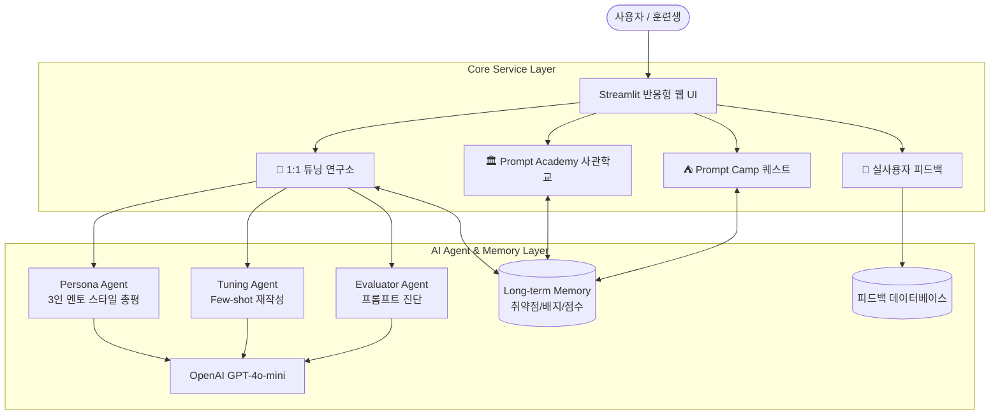

# 🚀 Prompt Camp to Academy (AI 프롬프트 사관학교)

> **"두루뭉술한 질문은 그만! 나만의 AI 스타 멘토와 함께 퀘스트를 깨며 완성하는 실전 AI 문해력(AI Literacy) 트레이닝 서비스"**

---

## 📌 1. 프로젝트 소개
대부분의 생성형 AI 입문자는 질문창 앞에서 무엇을 어떻게 입력해야 할지 몰라 단답형으로 질문하고, AI가 뻔하고 두루뭉술한 답변을 내놓으면 "AI는 별로네" 하며 쉽게 포기합니다.

**Prompt Camp to Academy**는 이러한 초보자의 진입장벽을 허물기 위해 만들어진 **AI 네이티브 훈련 시뮬레이션 플랫폼**입니다.
- **1단계 Prompt Camp (부트캠프)**: 타이핑 부담 없는 객관식/빈칸 퀴즈를 통해 필수 3요소(역할, 형식, 제약)를 게임처럼 학습합니다.
- **2단계 Prompt Academy (사관학교)**: 부트캠프 통과자에게 주어지는 실전 미션(할루시네이션 팩트체크 사냥 및 복합 지시)을 수행합니다.
- **1:1 프롬프트 튜닝 연구소**: 평소 내 질문 vs 멘토가 교정한 질문의 답변을 **좌/우 2분할 화면**으로 실시간 대조하여 드라마틱한 품질 차이를 직접 체감합니다.
- **3인 3색 스타 멘토링 & Memory**: 츤데레 선배, 비타민 아이돌, 열정 교관 중 원하는 멘토를 선택하고 나의 프롬프트 취약점을 기억하는 개인화 코칭을 받습니다.

---

## 👥 2. 팀원 및 역할

| 이름 | 역할 | 담당 업무 |
| :---: | :---: | :--- |
| **팀원 1** | **PM / AI Agent** | 서비스 기획 총괄, AI Agent(Evaluator & Tuning Agent) 아키텍처 및 프롬프트 엔지니어링 |
| **팀원 2** | **Frontend / UI** | Streamlit 기반 반응형 웹 인터페이스, 퀘스트 컴포넌트 및 좌우 분할 연구소 화면 구현 |
| **팀원 3** | **AI / Memory** | Long-term Memory 모듈 설계, 멘토 페르소나 System Prompt 최적화, 취약점 분석 로직 구축 |
| **팀원 4** | **Backend / Data** | 퀘스트 데이터셋 구축, 피드백 수집 및 영속화 데이터 파이프라인 관리 |
| **팀원 5** | **QA / 배포** | Streamlit Community Cloud 배포, 실사용자(5인 이상) 테스트 진행 및 피드백 수렴 |

---

## 🛠️ 3. 기술 스택

- **Language & Framework**: Python 3.10+, Streamlit
- **AI & LLM**: OpenAI API (`gpt-4o-mini`), Few-shot Prompt Tuning Engine
- **Storage & Memory**: Local JSON 기반 Long-term Memory & Feedback Repository
- **Deployment**: Streamlit Community Cloud / Vercel / Render

---

## 🏗️ 4. 시스템 아키텍처



---

## 🤖 5. 핵심 AI 활용 및 기술 요건

### 1) AI Agent (다중 에이전트 파이프라인)
- **Evaluator Agent**: 사용자의 질문에서 역할(Role), 맥락(Context), 출력형식(Format)의 포함 여부를 분석
- **Tuning Agent**: 거친 단답형 질문을 전문가 수준의 구조화된 프롬프트로 재작성하고 고품질 결과물 동시 생성
- **Persona Agent**: 선택된 멘토(차도혁-선배, 유하린-아이돌, 강태산-교관)의 고유한 성격과 말투로 1:1 현장 코칭 총평 생성

### 2) Long-term Memory (취약점 및 학습 이력 영속화)
- 사용자가 문제를 풀며 자주 실수하는 취약점 패턴(예: '출력 형식 누락 2회')을 자동 집계
- 사용자의 누적 점수 및 획득 배지를 관리하여 다음 훈련 시 멘토 피드백에 개인화 반영

### 3) 2단계 게이미피케이션 (Gamification)
- 부트캠프 3개 퀘스트 클리어 시 공식 **'사관학교 입교 합격증'** 발급 및 사관학교 전용 심화 코스 오픈

---

## 🚀 6. 설치 및 실행 방법

### 요구사항
- Python 3.10 이상

### 설치 및 로컬 실행
```bash
# 1. 저장소 클론
git clone https://github.com/your-team/prompt-camp-academy.git
cd prompt-camp-academy

# 2. 의존성 패키지 설치
pip install -r requirements.txt

# 3. Streamlit 앱 실행
streamlit run app.py
```
> 브라우저에서 `http://localhost:8501`로 자동 접속됩니다.  
> (OpenAI API 키가 없어도 자체 내장된 스마트 시뮬레이션 데모가 즉시 동작합니다.)

---

## 📊 7. 실사용자 테스트 및 피드백 결과 (5인 이상 요건)

서비스 내 내장된 피드백 수집 탭을 통해 동료 학습자 및 일반 사용자의 의견을 수집하고 반영하였습니다:

| 테스터 | 소속 | 평점 | 주요 피드백 및 반영 사항 |
| :---: | :---: | :---: | :--- |
| **김OO** | AI 교육생 | 5.0 ⭐ | "좌우로 결과가 한눈에 비교되니까 왜 형식을 지정해야 하는지 바로 이해됨." ➡️ **추천 질문 원클릭 버튼 추가 반영** |
| **이OO** | 비개발자 | 5.0 ⭐ | "질문창에 뭘 칠지 항상 막막했는데 객관식 퀴즈부터 시작해서 부담이 전혀 없었음." |
| **박OO** | 취업준비생 | 4.0 ⭐ | "차도혁 선배 말투가 너무 찰떡이라 재밌음. 멘토 음성도 나오면 좋겠음." ➡️ **향후 TTS 도입 계획 수립** |
| **최OO** | 직장인 | 5.0 ⭐ | "회사 보고서 요약 프롬프트 짤 때 연구소에서 튜닝한 프롬프트 그대로 복사해서 써먹음." |
| **정OO** | 대학생 | 5.0 ⭐ | "사관학교 합격증 나오는 화면에서 성취감이 들었음." ➡️ **배지 보관함 시각화 개선** |

---

## 🔗 8. 주요 링크 및 산출물
- **배포 URL**: *(Streamlit Cloud 배포 URL 입력)*
- **기획서**: [01_프로젝트_기획서.md](01_프로젝트_기획서.md)
- **기능 요구 명세서**: [02_기능_요구사항_명세서.md](02_기능_요구사항_명세서.md)
- **화면 흐름 설계서**: [03_서비스_화면_및_사용자_흐름_설계.md](03_서비스_화면_및_사용자_흐름_설계.md)
